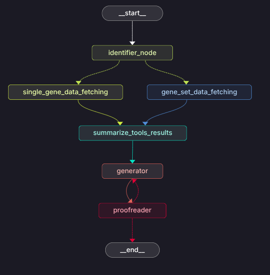

# Agentic Workflow for GeneAgent 🦜🔗🧬


It is a streamlined and modular pipeline designed to extract **entities** from **biomedical claims**, gather context from multiple trusted sources, and generate accurate, verifiable, and well-structured claims using an agentic workflow.

This project helps automate biomedical fact-checking, entity-driven context retrieval, and final claim generation using LLM-based agents ⚙️🤖.

## Workflow


## Install Dependencies and Start Langgraph Studio
```bash
pip install -r requirements.txt
```
To start **Langgraph Studio** execute the below command.
```bash
langgraph dev
```